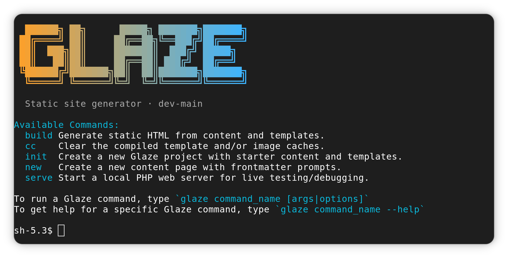

<h1 align="center">🍬 Glaze — static site generator for modern PHP</h1>

	

	
	
	
	
    
	

---

Glaze is a fast, modern static site generator for PHP developers who want content-first authoring without a heavy framework in the way.

> 📚 **Documentation:** https://josbeir.github.io/glaze/

### Quick workflow

- write content in Djot
- shape output with Sugar templates
- generate static files for reliable, simple deployment

Glaze stays lightweight while still giving you practical features like frontmatter, taxonomy-aware discovery, template context helpers, and an ergonomic CLI (`glaze init`, `glaze build`, `glaze serve`).

Glaze is built around:

- [Djot](https://djot.net/) content (via [php-collective/djot-php](https://github.com/php-collective/djot-php))
- [Sugar](https://josbeir.github.io/sugar/) templates
- [NEON](https://github.com/nette/neon/) configuration for both page frontmatter and project/site config

If you like clean files, modern templating, and quick iteration, Glaze is made for you.

## Documentation

Start here: [https://josbeir.github.io/glaze/](https://josbeir.github.io/glaze/)

## License

Glaze is licensed under the MIT License. See [LICENSE](LICENSE.md).

## Contributing

Contributions are welcome. Please read [Contributing](https://josbeir.github.io/sugar) for setup steps and guidelines.
